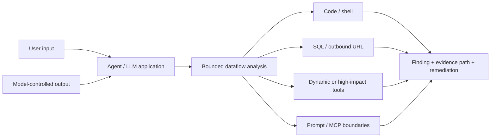

# LLMSafe

[](https://github.com/rezerpaul-crypto/llmsafe/actions/workflows/ci.yml)
[](https://github.com/rezerpaul-crypto/llmsafe/actions/workflows/code-scanning.yml)
[](https://pypi.org/project/llmsafe/)
[](LICENSE)
[](pyproject.toml)

**Static security analysis built for Python AI agents.**

LLMSafe traces untrusted user input and model-controlled data into code execution, shells, SQL,
outbound URLs, and dynamic tools. It also flags high-impact agent tools, privileged prompt
construction, secrets, unsafe Python, and risky MCP configuration—before deployment.

**No API key. No model calls. No source upload. One local scan command.**

[Quick start](#start-in-60-seconds) · [See a real finding](#see-the-risk-not-just-the-api) ·
[Why LLMSafe](docs/why-llmsafe.md) · [Rule catalog](docs/rules.md) ·
[GitHub Action](docs/github-action.md) · [Request a pilot](docs/pilot-program.md)

> **Project status:** `v0.2.1` is the current stable release. `v0.3.0rc1` is a public pilot
> pre-release with bounded cross-file analysis and expanded integration contracts. LLMSafe returns
> reviewable security evidence; it does not certify that an AI system is secure.

## The security question LLMSafe answers

General Python scanners can identify a dangerous API. Agentic applications add a second question:

> **Can data controlled by a user or model reach that dangerous capability?**

LLMSafe models that trust boundary directly:



The scanner parses source and configuration without importing the target project, executing tools,
contacting a model provider, or requiring deployed access.

## Start in 60 seconds

LLMSafe supports Python 3.9 and newer.

```bash
python -m pip install llmsafe
llmsafe .
```

Scan selected paths and fail CI on medium-or-higher findings:

```bash
llmsafe src agent.py --fail-on medium --exclude "generated/**"
```

Generate reviewable reports for automation and GitHub Code Scanning:

```bash
llmsafe . --format json --output reports/llmsafe.json
llmsafe . --format sarif --output reports/llmsafe.sarif
```

Prefer an isolated one-off run? Use the pinned stable release with pipx:

```bash
pipx run --spec llmsafe==0.2.1 llmsafe . --fail-on high
```

See [local integration](docs/local-integration.md) for pre-commit and baseline adoption, or run the
[credential-free five-minute demo](docs/demo.md).

## See the risk, not just the API

```python
def run_agent(client, user_input):
    response = client.responses.create(input=user_input)
    generated_code = response.output_text
    return eval(generated_code)
```

LLMSafe reports the dangerous operation **and** the evidence path from user/model-controlled data:

```text
agent.py:4:12: CRITICAL FLOW001 Untrusted data reaches code execution
  Untrusted or model-controlled data flows into eval(). Source: model, user.
  Trace 2:16: model source: client.responses.create
  Trace 1:23: user source: user_input
  Trace 4:12: reaches eval
  Fix: Replace dynamic execution with a typed parser and an allow-listed operation.
```

That path is the core product: a reviewer can see **what is controlled, where it flows, which
capability it reaches, and how to remove the boundary failure**.

## What makes LLMSafe different

| Design choice | What it gives you |
| --- | --- |
| Agent-native trust model | User input and model output are treated as untrusted when they reach code, processes, queries, URLs, or tools. |
| Explainable, bounded dataflow | Findings include source-to-sink evidence across direct calls and supported local-module helpers instead of only naming a risky API. |
| Static and credential-free | Scan pull requests and source trees without running the application, invoking a model, or uploading code. |
| Stable automation contracts | Versioned JSON, deterministic SARIF, rule metadata, and documented exit codes for CI and security tooling. |
| Low-friction adoption | Start locally, add a reviewed baseline for existing findings, then enforce only new risk in pre-commit or CI. |
| Security-engineering scope | Explicit limitations, safe counterexamples, regression fixtures, and remediations are part of the public contract. |

Read [why LLMSafe exists](docs/why-llmsafe.md) for the full positioning, use cases, and decision
guide. The [threat model](docs/threat-model.md) states exactly what LLMSafe protects and what remains
out of scope.

## Detection coverage

LLMSafe currently publishes 23 stable built-in rule IDs:

| Family | Rule IDs | Examples |
| --- | --- | --- |
| Dataflow | `FLOW001`–`FLOW005` | Model/user data reaching code, shell, SQL, URL, or tool dispatch |
| Agent tools | `AGENT001`–`AGENT003` | Python/shell tools, dangerous capability flags, disabled approval |
| Secrets | `SECRET001`–`SECRET005` | Provider keys, tokens, private keys, hard-coded credentials |
| Python | `PY001`–`PY004` | `eval`, `exec`, unsafe pickle and YAML deserialization |
| Shell | `SHELL001`–`SHELL002` | `os.system` and `subprocess(..., shell=True)` |
| Prompt trust | `LLM001` | Dynamic data interpolated into system/developer instructions |
| MCP | `MCP001`–`MCP003` | Shell launch, remote HTTP, wildcard tool permissions |

See the [complete rule catalog](docs/rules.md), [framework coverage matrix](docs/framework-coverage.md),
and [cross-file analysis boundary](docs/cross-file-analysis.md). Framework names describe tested
syntax—not blanket support for every framework feature.

Integrations can query the same catalog without parsing documentation:

```bash
llmsafe --list-rules
llmsafe --list-rules --format json
```

Trusted internal tooling can add explicit organization-specific checks through the small
[`llmsafe.api` extension surface](docs/extensions.md); the CLI does not dynamically load plugins.

## Where LLMSafe fits in an AI security stack

| Need | Use | LLMSafe's role |
| --- | --- | --- |
| Broad language and API security | General SAST / Python security linter | Complement it with AI-agent trust-boundary analysis. |
| Organization-specific patterns | Pattern-rule engine | Use LLMSafe's opinionated agent rules without writing a rule first. |
| Vulnerable dependencies | SCA / dependency scanner | Out of scope; run it alongside LLMSafe. |
| Prompt, model, or deployed-agent attacks | Evaluation / red-team tooling | Complement runtime probing with pre-deployment source analysis. |
| Live authorization and containment | Runtime guardrails / sandbox | Out of scope; use LLMSafe to review code and configuration before runtime. |
| Model/user data reaching dangerous capabilities | **LLMSafe** | Trace the source-to-sink path and return actionable evidence. |

LLMSafe is not trying to replace a complete AppSec stack. It owns one high-value layer: **static
analysis of the code paths that connect untrusted AI data to real application capabilities**.

## Choose your path

| You are… | Start here | Outcome |
| --- | --- | --- |
| Building a Python agent | [Five-minute demo](docs/demo.md) | See a vulnerable flow, SARIF export, fix, and clean rescan. |
| Adding checks to an existing repository | [Local integration](docs/local-integration.md) | Adopt with pipx, pre-commit, and a reviewed baseline. |
| Owning CI or AppSec | [GitHub Action](docs/github-action.md) | Upload SARIF and enforce a documented severity threshold. |
| Building security tooling | [Integration contracts](docs/integration-contracts.md) | Consume stable JSON, SARIF, exit codes, and rule metadata. |
| Maintaining an AI/MCP project | [Compatibility pilot](docs/pilot-program.md) | Request a bounded, private compatibility review of public source. |
| Contributing a detection | [Rule-authoring guide](docs/rule-authoring.md) | Add a rule with vulnerable, safe, and edge-case tests. |

## GitHub Code Scanning

The repository includes a reusable composite action. A consumer workflow can scan, upload SARIF,
then enforce the configured threshold:

```yaml
permissions:
  contents: read
  security-events: write

steps:
  - uses: actions/checkout@v7
  - uses: actions/setup-python@v7
    with:
      python-version: "3.12"
  - id: llmsafe
    continue-on-error: true
    uses: rezerpaul-crypto/llmsafe@v0.2.1
    with:
      path: .
      fail-on: high
  - if: always()
    uses: github/codeql-action/upload-sarif@v4
    with:
      sarif_file: ${{ steps.llmsafe.outputs.sarif-file }}
  - if: steps.llmsafe.outcome == 'failure'
    run: exit 1
```

The action returns the SARIF path and scanner exit code. It needs only `contents: read` plus
`security-events: write` for SARIF upload; it does not require repository write access. Pin the
action to a release tag or its full commit SHA. See the [complete action contract](docs/github-action.md).

## Adopt without hiding existing risk

Existing repositories can review and commit a baseline of current findings:

```bash
llmsafe . --write-baseline .llmsafe-baseline.json
llmsafe . --baseline .llmsafe-baseline.json
```

The second command reports and fails only on findings not represented in the baseline. Matching is
line-independent, duplicate-aware, and deterministic, so ordinary code movement does not create
noise while an additional dangerous operation is still reported. Baselines are review artifacts,
not permanent suppressions; see [incremental adoption](docs/baselines.md).

For one reviewed finding, use a narrow rule-specific suppression:

```python
# llmsafe: ignore[PY001] -- expression is generated from a fixed internal grammar
result = eval(TRUSTED_EXPRESSION)
```

Repository policy can live in `.llmsafe.toml` or under `[tool.llmsafe]` in `pyproject.toml`:

```toml
[llmsafe]
exclude = ["generated/**", "vendor/**"]
fail_on = "high"
max_file_size = 1000000
disabled_rules = ["PY004"]
```

See [configuration](docs/configuration.md) for the complete contract.

## Automation contracts

Exit codes are stable:

| Code | Meaning |
| --- | --- |
| `0` | No finding at or above the selected threshold |
| `1` | At least one finding reached the selected threshold |
| `2` | Invalid configuration, missing target, or scan error |

The versioned JSON output, SARIF, catalog, and exit-code contracts are documented in
[machine-readable integration contracts](docs/integration-contracts.md).

## Evidence, not inflated claims

The checked-in regression corpus currently expects 35 rule-level signals across vulnerable and
safe examples for direct, local-helper, and supported framework patterns:

```bash
python -m benchmarks.run
```

This is a regression corpus—not an industry benchmark or a claim of real-world detection rate. The
[benchmark methodology](docs/benchmark.md), [real-world benchmark protocol](docs/real-world-benchmark-protocol.md),
and [performance budget](docs/performance.md) make that distinction explicit.

## Contributing, support, and security

LLMSafe is early and intentionally open to rigorous feedback. Useful contributions include new
agent boundaries, safe counterexamples, reproducible false positives, framework fixtures,
integration improvements, and technical documentation.

- Start with [CONTRIBUTING.md](CONTRIBUTING.md) and the [public roadmap](ROADMAP.md).
- Ask installation or usage questions through [SUPPORT.md](SUPPORT.md).
- Report vulnerabilities privately according to [SECURITY.md](SECURITY.md).
- Read [GOVERNANCE.md](GOVERNANCE.md) and the [Code of Conduct](CODE_OF_CONDUCT.md) before participating.

The complete contributor setup and quality suite is one command:

```bash
python3 scripts/dev.py
```

LLMSafe is released under the [MIT License](LICENSE).
