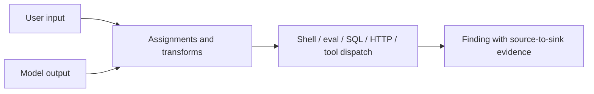

# LLMSafe

[](https://github.com/rezerpaul-crypto/llmsafe/actions/workflows/ci.yml)
[](https://github.com/rezerpaul-crypto/llmsafe/actions/workflows/code-scanning.yml)
[](https://pypi.org/project/llmsafe/)
[](LICENSE)
[](pyproject.toml)

LLMSafe is an open-source static security scanner for AI-powered and agentic Python
applications. It traces user input and model-controlled data into dangerous capabilities such as
code execution, shells, SQL, outbound requests, and dynamic tool dispatch.

It runs locally. Source code is not uploaded to a model or external analysis service.

> **Status:** `v0.2.1` is an early release. LLMSafe provides reviewable security signals, not a
> guarantee that an AI system is secure.

## Why another security scanner?

Traditional Python scanners are good at finding dangerous APIs. Agentic applications add a
different question: **can untrusted user or model output reach that capability?**



LLMSafe combines focused API checks with AST-based dataflow and agent-framework rules:

```python
def run_agent(client, user_input):
    response = client.responses.create(input=user_input)
    generated_code = response.output_text
    return eval(generated_code)
```

The scanner reports both the dangerous `eval()` and the path from the model response to that
sink:

```text
agent.py:4:12: CRITICAL FLOW001 Untrusted data reaches code execution
  Untrusted or model-controlled data flows into eval(). Source: model, user.
  Trace 2:16: model source: client.responses.create
  Trace 1:23: user source: user_input
  Trace 4:12: reaches eval
  Fix: Replace dynamic execution with a typed parser and an allow-listed operation.
```

## Detection coverage

| Family | Rule IDs | Examples |
| --- | --- | --- |
| Dataflow | `FLOW001`–`FLOW005` | Model/user data reaching code, shell, SQL, URL, or tool dispatch |
| Agent tools | `AGENT001`–`AGENT003` | Python/shell tools, dangerous capability flags, disabled approval |
| Secrets | `SECRET001`–`SECRET005` | Provider keys, tokens, private keys, hard-coded credentials |
| Python | `PY001`–`PY004` | `eval`, `exec`, unsafe pickle and YAML deserialization |
| Shell | `SHELL001`–`SHELL002` | `os.system` and `subprocess(..., shell=True)` |
| Prompt trust | `LLM001` | Dynamic data interpolated into system/developer instructions |
| MCP | `MCP001`–`MCP003` | Shell launch, remote HTTP, wildcard tool permissions |

See the [complete rule catalog](docs/rules.md) and [threat model](docs/threat-model.md).

## Install

LLMSafe supports Python 3.9 and newer.

```bash
python3 -m venv .venv
source .venv/bin/activate
python -m pip install llmsafe
```

For development:

```bash
git clone https://github.com/rezerpaul-crypto/llmsafe.git
cd llmsafe
python3 -m venv .venv
source .venv/bin/activate
python -m pip install -e ".[dev]"
```

## Use the CLI

Scan the current repository:

```bash
llmsafe .
```

Scan selected paths and fail on medium-or-higher findings:

```bash
llmsafe src agent.py --fail-on medium --exclude "generated/**"
```

Generate machine-readable reports:

```bash
llmsafe . --format json --output reports/llmsafe.json
llmsafe . --format sarif --output reports/llmsafe.sarif
```

Exit codes are stable for automation:

| Code | Meaning |
| --- | --- |
| `0` | No finding at or above the selected threshold |
| `1` | At least one finding reached the selected threshold |
| `2` | Invalid configuration, missing target, or scan error |

## Repository policy

Commit a `.llmsafe.toml` file:

```toml
[llmsafe]
exclude = ["generated/**", "vendor/**"]
fail_on = "high"
max_file_size = 1000000
disabled_rules = ["PY004"]
```

CLI options override or extend repository policy. Policy can also live under `[tool.llmsafe]` in
`pyproject.toml`. See [configuration](docs/configuration.md).

### Suppress one reviewed finding

Place a narrow suppression on the finding line or immediately above it:

```python
# llmsafe: ignore[PY001] -- expression is generated from a fixed internal grammar
result = eval(TRUSTED_EXPRESSION)
```

Prefer a rule-specific suppression over a bare `llmsafe: ignore`.

## GitHub Code Scanning

The repository includes a reusable composite action. A consumer workflow can scan, upload SARIF,
then enforce the configured threshold:

```yaml
permissions:
  contents: read
  security-events: write

steps:
  - uses: actions/checkout@v7
  - uses: actions/setup-python@v7
    with:
      python-version: "3.12"
  - id: llmsafe
    continue-on-error: true
    uses: rezerpaul-crypto/llmsafe@v0.2.1
    with:
      path: .
      fail-on: high
  - if: always()
    uses: github/codeql-action/upload-sarif@v4
    with:
      sarif_file: ${{ steps.llmsafe.outputs.sarif-file }}
  - if: steps.llmsafe.outcome == 'failure'
    run: exit 1
```

The workflow uses only `contents: read` and `security-events: write`.

## Pre-commit

```yaml
repos:
  - repo: https://github.com/rezerpaul-crypto/llmsafe
    rev: v0.2.1
    hooks:
      - id: llmsafe
```

## Benchmark

The checked-in benchmark exercises vulnerable and safe agent boundaries:

```bash
python -m benchmarks.run
```

Current expectations cover 13 rule-level signals across code execution, shell execution, SQL,
SSRF, tool dispatch, prompt boundaries, high-impact tools, approval bypasses, and MCP. This is a
regression corpus—not an industry benchmark or a claim of real-world detection rate. See the
[benchmark methodology](docs/benchmark.md).

## How LLMSafe fits

| Tool category | Primary strength | LLMSafe relationship |
| --- | --- | --- |
| General Python SAST | Broad language and API security checks | Complementary; LLMSafe focuses on AI/agent trust boundaries |
| Pattern-rule engines | Highly customizable organizational rules | LLMSafe supplies opinionated agent rules without rule authoring |
| Dependency scanners | Known vulnerable packages and supply chain | Out of scope; run alongside LLMSafe |
| Runtime guardrails | Enforce live policy and monitor model/tool calls | Out of scope; LLMSafe reviews source and configuration before runtime |

Read the [architecture](docs/architecture.md) for implementation boundaries and tradeoffs.

## Contributing and security

Contributions are welcome. Start with [CONTRIBUTING.md](CONTRIBUTING.md) and the public
[roadmap](ROADMAP.md). Report vulnerabilities privately according to [SECURITY.md](SECURITY.md).

LLMSafe is released under the [MIT License](LICENSE).
