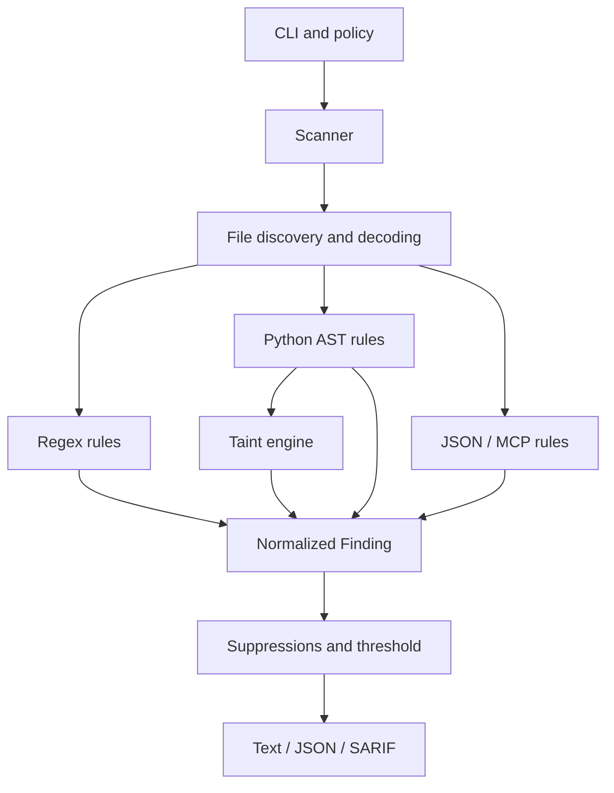

# Architecture

LLMSafe is a local, dependency-light static analyzer. It separates file discovery, rule execution,
policy, data models, and output rendering so that new rules do not need to know about the CLI or
filesystem traversal.



## Components

- `llmsafe.scanner.Scanner` owns traversal, decoding limits, excludes, suppressions, rule
  isolation, deduplication order, and aggregate results.
- `llmsafe.rules` contains independent rules that accept a path and UTF-8 content and yield
  normalized findings.
- `llmsafe.rules.dataflow` performs source-to-sink analysis within a Python module or function.
- `llmsafe.config` discovers and validates repository policy.
- `llmsafe.models` is the stable boundary between analysis and output.
- `llmsafe.sarif` maps normalized findings and evidence to SARIF 2.1.0.
- `llmsafe.cli` is a thin orchestration and exit-code layer.

## Taint-analysis algorithm

The `DataflowRule` analyzes the module body and every function independently:

1. Function arguments with trust-boundary names become user or model sources.
2. Known request objects and LLM SDK calls create additional sources.
3. Assignments, interpolation, containers, attribute access, calls, branches, loops, and exception
   branches propagate source sets through an environment keyed by variable name.
4. Calls are checked against code, process, SQL, HTTP, and dynamic-dispatch sinks.
5. A finding records up to four contributing sources and the final sink as evidence.

Branch environments are merged conservatively. Reassigning a variable to an untainted expression
kills its previous taint in the current path.

## Why intra-procedural first?

Intra-procedural analysis provides useful signal with deterministic performance and without a
project-wide type resolver. It catches common agent loops where model output is received,
transformed, and dispatched in the same handler. Inter-procedural summaries are a planned
extension; the current boundary is documented so users do not mistake the scanner for a complete
program proof.

## Rule failure isolation

A rule exception is recorded as a scan error instead of terminating the full scan. This protects
CI availability while preserving a non-zero exit code. Syntax-invalid Python is ignored by AST
rules but can still be inspected by text rules.

## Determinism

- Findings are sorted by severity, path, line, and rule ID.
- JSON and SARIF keys are sorted at serialization time.
- SARIF fingerprints exclude line numbers so alerts survive small line shifts.
- The scanner never performs network requests or imports the analyzed application.

## Extension contract

A rule implements one method:

```python
class Rule(Protocol):
    def scan(self, path: Path, content: str) -> Iterable[Finding]: ...
```

Rules should prefer structural parsing, emit stable IDs, avoid secret values in messages, include
actionable remediation, and provide vulnerable/safe regression tests.

## Known architectural limits

- No inter-procedural call graph or alias analysis across files.
- No runtime values, dependency resolution, generated code, or authorization-server state.
- Python and MCP JSON receive structural analysis; other languages currently receive secret checks.
- Taint source names and SDK call markers are intentionally opinionated heuristics.
- Sanitizer correctness is domain-specific, so the current engine does not silently clear taint
  based on generic escaping calls.

These limits favor explainable results and give future work clear compatibility boundaries.
