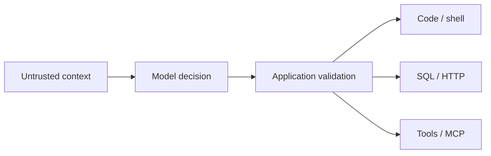

# Why LLMSafe?

LLMSafe is a static security scanner for Python AI agents, LLM applications, and MCP integrations.
It exists to answer a narrow but important pre-deployment question:

> Can data controlled by a user or model reach a capability that executes code, starts a process,
> changes a query, chooses a URL, or dispatches a tool?

That question is easy to miss when an application treats model output as a trusted decision instead
of untrusted input.

## The gap between a model and a capability

An agent often sits between probabilistic input and deterministic authority:

The safe design keeps execution authority in application-owned code: typed parsing, fixed tool
registries, allow-listed destinations, parameterized queries, least privilege, and approval gates
enforced outside model-controlled state.

The unsafe design lets model or user data select the operation, construct command/query structure,
choose an arbitrary destination, or disable the approval boundary. LLMSafe searches for evidence of
those transitions in source and configuration.

## What LLMSafe contributes

### 1. An agent-native trust model

LLMSafe treats user input and model-produced data as untrusted sources. It looks for their path into
five high-impact sink families: dynamic code execution, process execution, SQL structure, outbound
URLs, and dynamic callable or tool selection.

Structural rules add agent-tool, privileged-prompt, secret, unsafe Python, shell, and MCP
configuration checks even where dataflow cannot prove a complete path.

### 2. Evidence a reviewer can follow

A useful security finding should answer four questions:

1. What data is untrusted?
2. How did it move through the application?
3. Which capability did it reach?
4. What design change removes or narrows the boundary?

LLMSafe findings include stable rule IDs, severity, source and sink locations where supported, and a
specific remediation. The current cross-file analysis is deliberately bounded; unsupported dynamic
or runtime behavior is documented rather than implied.

### 3. A check that runs before the system exists

LLMSafe does not require a deployed agent, model account, API key, production credential, or test
prompt corpus. It does not import or execute the target application. That makes it suitable for a
developer laptop, pre-commit, pull-request CI, and GitHub Code Scanning.

Static analysis cannot prove runtime safety. Its advantage is finding reviewable code and
configuration risks early, reproducibly, and without giving the scanner access to the system under
review.

### 4. Adoption without an all-or-nothing gate

New projects can fail immediately on high-severity findings. Existing projects can first export
JSON, review every result, commit a count-aware baseline, and then block newly introduced risk.
Rule-specific suppressions remain visible in code review.

## Who LLMSafe is for

- **AI application developers** who connect model output to tools, data stores, HTTP services, or
  local execution.
- **Agent and MCP maintainers** who want regression coverage for dangerous capability boundaries.
- **AppSec and platform teams** that need SARIF, stable exit codes, machine-readable findings, and a
  local-only scanning path.
- **Open-source maintainers** who want a bounded compatibility review without sharing credentials or
  private source code.
- **Security researchers and contributors** who want stable rule IDs, safe counterexamples, and a
  reproducible benchmark harness.

## What LLMSafe is not

LLMSafe is not:

- a model evaluation or red-team runner;
- a prompt-injection guarantee;
- a runtime sandbox, authorization service, or policy enforcement point;
- a dependency, malware, or Git-history scanner;
- a penetration test, compliance assessment, or security certification;
- proof that a reported finding is exploitable or that a clean scan means an application is safe.

These are complementary layers, not competitors for one universal security check.

## Which layer do you need?

| Question | Primary layer | How LLMSafe helps |
| --- | --- | --- |
| Does ordinary Python code use risky APIs? | General Python SAST / security linter | Adds AI-agent source and trust-boundary context. |
| Do we need custom organization-wide code patterns? | Pattern-rule engine | Provides opinionated built-in AI/agent rules and an explicit Python API for trusted extensions. |
| Can a running model be induced to fail? | Model evaluation / red-team tooling | Finds source-level paths that runtime probes may eventually exercise. |
| Are third-party packages vulnerable? | SCA / dependency scanning | Does not overlap; run both. |
| Are live tool calls authorized and contained? | Runtime guardrails, sandbox, and authorization | Reviews whether source/configuration weakens those boundaries before deployment. |
| Can untrusted AI data reach a dangerous capability? | **LLMSafe** | Produces a source-to-sink finding with remediation. |

## A practical evaluation path

Evaluate LLMSafe on evidence, not slogans:

1. Run the [five-minute demo](demo.md) without credentials.
2. Review the [threat model](threat-model.md) and [framework matrix](framework-coverage.md).
3. Inspect vulnerable and safe fixtures in `benchmarks/cases/`.
4. Scan one bounded directory and export JSON or SARIF.
5. Classify each result as useful, noisy, unclear, or missing an important boundary.
6. Report reproducible false positives and false negatives through the documented support routes.

Maintainers of suitable public Python AI or MCP repositories can also request a free, consent-first
[compatibility pilot](pilot-program.md). The project controls scope, private reporting, and every
later disclosure decision.

## Product direction

LLMSafe aims to become the most useful open-source pre-deployment scanner for Python AI-agent trust
boundaries. Progress is measured through reproducible detection quality, safe counterexamples,
real opt-in project feedback, stable integrations, and transparent limitations—not unverified
claims or vanity metrics.

See the [public roadmap](../ROADMAP.md), [architecture](architecture.md), and
[contribution guide](../CONTRIBUTING.md) for the work ahead.
